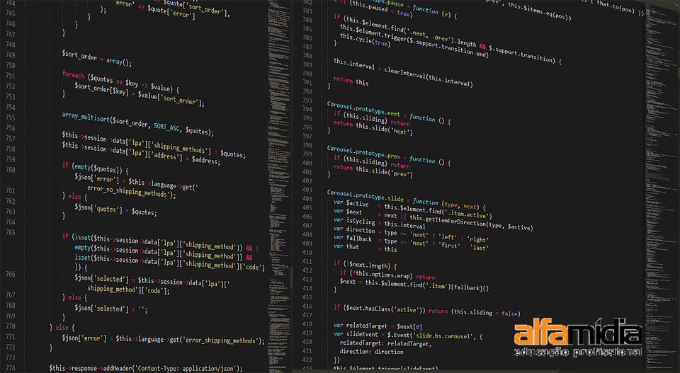

# Alfamidia: Curso de Desenvolvimento Web

## Grade curricular

### AWS - Amazon Web Services

- [x] Implantação de Ambiente PHP na AWS

### Banco de Dados & SQL

- [x] Banco de Dados: MySQL e Workbench;
- [x] Banco de Dados: Introdução ao SQL;
- [x] Apostila de Banco de Dados;
- [x] Apostila de PostgreSQL;
- [x] Apostila de Modelagem de Dados e SQL;

### Bootstrap

- [x] HTML na prática: Site c/ Bootstrap;
- [x] Bootstrap: Introdução;

### GIT

- Apostila de Introdução ao GIT

### HTML

- Introdução ao HTML e CSS;
- HTML na prática: Site de Viagens;
- HTML na prática: Site de Yoga;
- HTML na prática: Site de Cursos;
- Apostila WEB: HTML, CSS e JavaScript;
- Apostila de HTML5;
- Apostila de Layout de Sites;
- Apostila de XML;

### Lógica de Programação

- Aprenda a programar;
- Lógica de programação c/ JavaScript;
- Tópicos em lógica de programação c/ JavaScript;
- Lógica de programação | Versão 2020;
- Apostila de logica de programação;

### PHP

- Programando PHP c/ MVC | Criando a estrutura MVC;
- Programando PHP c/ MVC | Acesso ao Banco de Dados;
- Programando PHP c/ MVC | Vínculo entre duas tabelas;
- Lógica de programação em PHP;
- Estrutura de dados em PHP | Dados Primitivos;
- Estrutura de dados em PHP | Pilhas e filas;
- Estrutura de dados em PHP | Árvores Binárias;
- CRM em PHP | Cadastro de clientes;
- CRM em PHP | Observações e Negociações;
- CRM em PHP | Agenda de Negociações;
- Apostila de Sistemas de e-commerce em PHP;
- Apostila de Jomla;
- Apostila de MVC com PHP;
- Apostila de introdução ao PHP online;
- Apostila de AWS | Configurando Servidor Linux 2 EC2;
- Apostila de Laravel | Configurando Ambiente Laravel na Nuvem Amazon;
- Apostila de Migração de Aplicação PHP para Nuvem Amazon